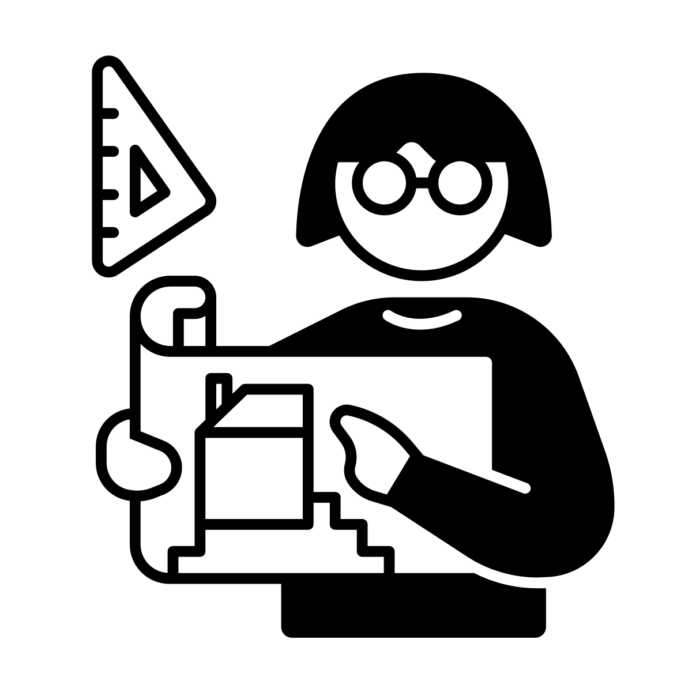
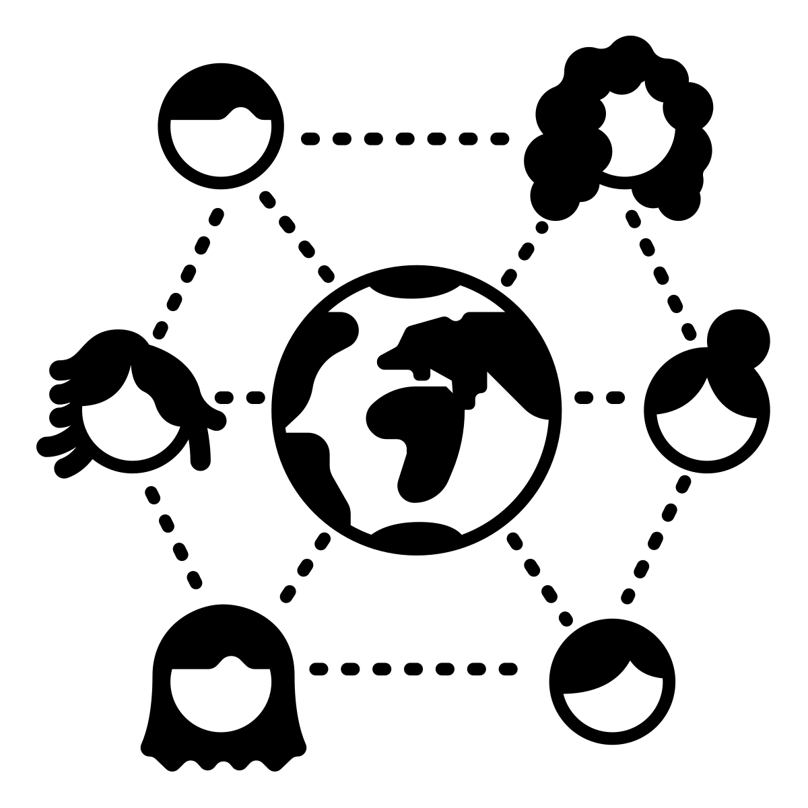
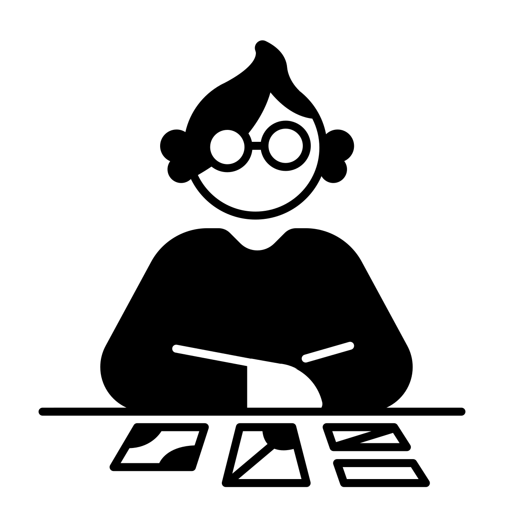
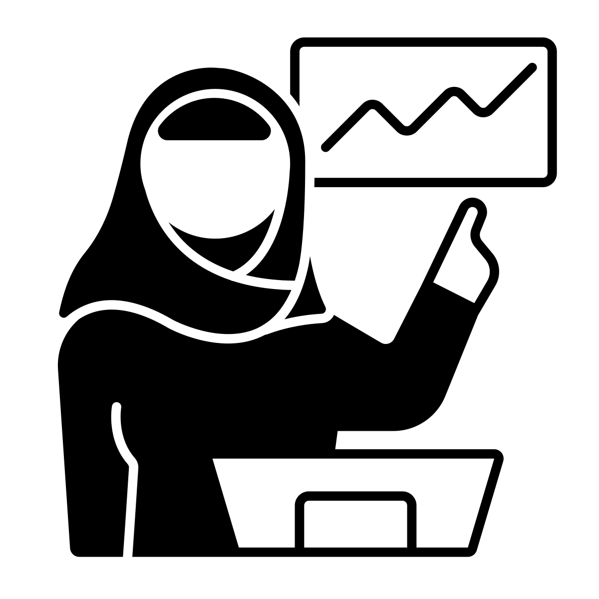
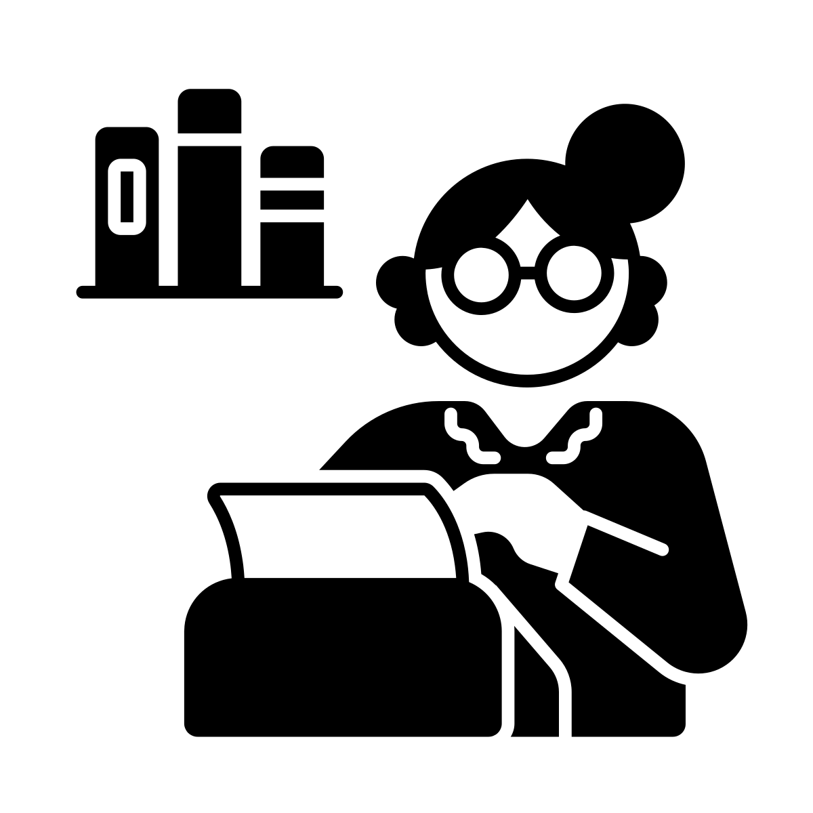

# Content

A good portfolio communicates and demonstrates your skills to the viewer. How you do that is something of a creative endeavor. We'll discuss potential sections and information you can include, but what you include is up to you and should be informed by your goals and objective. You should not try to include everything, but rather pick the information that supports your goal. Every portfolio needs a **Projects** and a **Contact Information** section, but the rest is up to you.

```{r, echo=FALSE, fig.alt="Black and white Noun Project Icon with a woman holdin up architectural plans while a ruler tool floats by her", out.width="25%"}

```

## Projects

The projects section is the heart of your portfolio. Here, you will provide a curated collection of projects you want to highlight. 

Project descriptions can be self-contained, or they can link out to other websites and code repositories. (You don't have to re-create things that you've published elsewhere.)

Consider including visuals in this section. If the project involves data visualization, such as a graph or map, you might choose that image as your visual. If the project was purely code, you could consider making a workflow diagram. You can include a stock image from the data provider, technology you used, or something related to the domain of the project - just be aware of the image's license and only use images that are open licensed or you have permission to use (and don't forget to include attributions).

The projects you list should support the goal you have for your portfolio. For example, if my goal is to demonstrate my data visualization skills, I could include code that produces a visualization, but I wouldn't include a script that cleans data and doesn't produce a visualization. If I feel like that cleaning script is valuable in telling my story, maybe I need to redefine and expand my goals for this portfolio. In that case, I might want to consider having sections for different kinds of projects, or sub-sections within a project.

**IDEA:** Consider separating projects into categories based on their type and/or skills used.


| **ACTIVITY 2** | 
|------------|
|Pick 3 projects you want to include in your portfolio. How do each of these support the goals of your portfolio?|

|**REPORT OUT: **|
|------------|
| Share one project & how it supports your goal.|

```{r, echo=FALSE, fig.alt="Black and white Noun Project Icon with a globe in the middle surrounded by faces connected with dotted lines", out.width="25%"}

```

## Contact Information

This section is also mandatory. You want people to know who you are so they can contact you if they are interested in your work. What information you provide is up to you. How do you decide? Reflect back on your goals. What contact information will help you achieve the goal for your portfolio? 

Here are some types of contact information to consider:

* Name - the name you use on your job applications and publications
* Other names you are well-known by (IRC handle, Discord handle, previous names you've published under, etc.)
* Email Address - whether you use an institutional or personal email address is up to you
* [ORCid](https://orcid.org/)
* [Google Scholar](https://scholar.google.com/) (if academic)
* Other academic profiles ([Academia.edu](https://www.academia.edu/), [Kudos](https://www.growkudos.com/), [Figshare](https://figshare.com/))
* [GitHub](https://github.com/) Profile - if you don't have a github account, now's a good time to make one!
* Other tech community profiles ([Stack Exchange](https://stackexchange.com/), [Stack Overflow](https://stackoverflow.com/), [Reddit](https://www.reddit.com/))
* [LinkedIn](https://www.linkedin.com) Profile
* Website - for your current organization or project(s)
* Work-related social media accounts that you use to represent yourself professionally (Twitter, Instagram, TikTok, YouTube, etc.)

```{r, echo=FALSE, fig.alt="Black and white Noun Project Icon showing a woman sitting at a table; on the table are cards containing different designs", out.width="25%"}

```

## About

The about section is the place to describe yourself, your background, and to give your portfolio more context. You might talk about your experience in and out of your current field. To help you write this section, take a look at the cultural norms of your domain, industry, and region. In some fields and countries it's common to talk about personal things such as your family and hobbies, while in other areas that information is often omitted.

```{r, echo=FALSE, fig.alt="Black and white Noun Project Icon showing a woman giving a talk, pointing at a screen with a graph; in front of her is a computer", out.width="25%"}

```

## Skills

Just like you might have on your CV, you can have a section where you list your skills.

**IDEA:** Consider organizing your portfolio by this list and linking each skill to that section of your website. Some website tools (particularly with content managers like Wordpress) will allow you to tag posts with keywords and then link to a search for that keyword.

```{r, echo=FALSE, fig.alt="Black and white Noun Project Icon showing a woman writing at a typewriter with a self of books nearby", out.width="25%"}

```

## Publications

Add a list of your publications with their DOI (digital object identifier) if available. Ideally, you can also link to the download site for each paper online to facilitate finding those papers. 

**IDEA:** Consider linking to your contact info page so people can easily to contact you about your papers.
